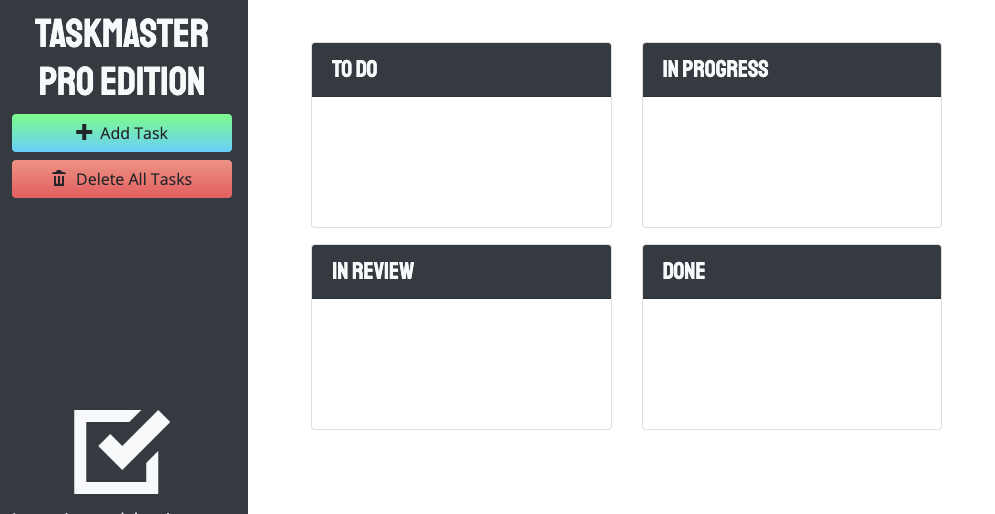

# Taskmaster Pro
  
  ## Description
  This KanBan style project manager uses Bootstrap and JQueryUI.

  
  ## Table of Contents
  * [Installation](#installation)
  * [Usage](#usage)
  * [License](#license)
  * [Contributing](#contributing)
  * [Tests](#tests)
  * [GitHub](#github)
  * [Credits](#credits)

  ## Installation
  Use the deployed version at cassie-s.github.io/taskmaster-pro

  ## Usage

  

  ## License
    
  This project uses  the [MIT](https://opensource.org/licenses/MIT) license.

  ## Contributing
  This project follows the Contributor Covenant  

  ## Questions
  Reach out via email or GitHub.  
  cassie.s.simpson@gmail.com  

  

